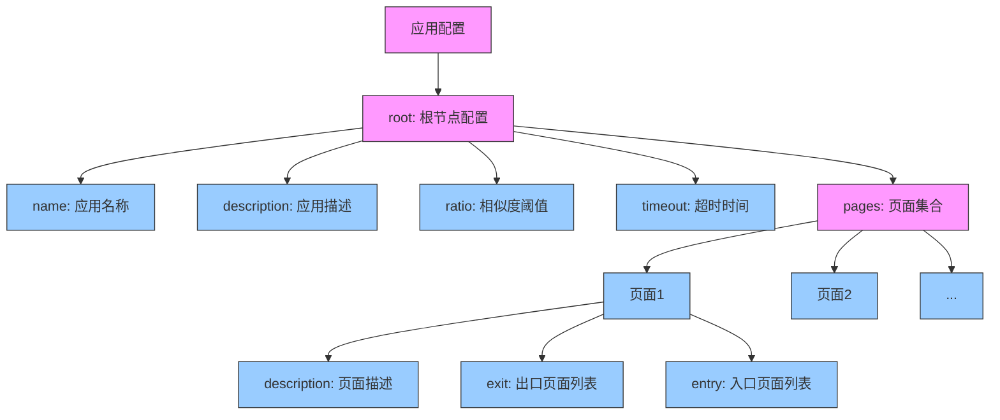
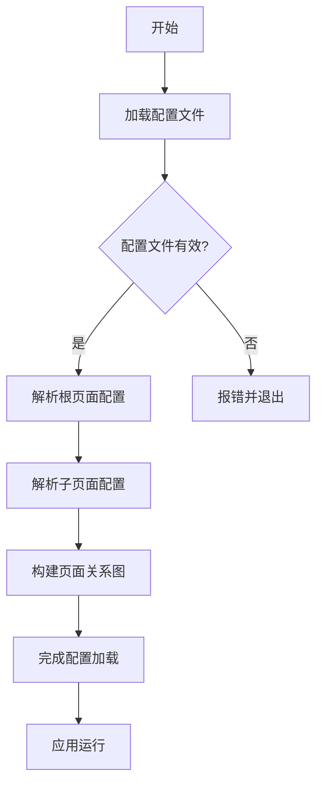

# 配置指导书

## 1. 配置概述
本指导书用于说明如何为应用编写配置文件。配置文件采用 JSON 格式，用于定义应用的页面结构、跳转逻辑和事件处理。

---

## 2. 配置文件结构
每个应用的配置文件应包含以下部分：
- **`root`**: 定义应用的根页面。
- **`pages`**: 定义应用的所有子页面及其属性。

### 示例配置
```json
{
  "root": {
    "name": "AppName",
    "description": "应用描述",
    "ratio": 10000,
    "timeout": 5,
    "pages": {
      "Page1": {
        "description": "页面1描述",
        "exit": ["Page2"],
        "entry": ["Page3"]
      },
      "Page2": {
        "description": "页面2描述",
        "exit": ["Page1"],
        "entry": ["Page3"]
      }
    }
  }
}
```

---

## 3. 配置字段说明
### 3.1 `root` 字段
| 字段名       | 类型   | 必填 | 说明                                                                 |
|--------------|--------|------|----------------------------------------------------------------------|
| `name`       | string | 是   | 应用名称，需唯一。                                                   |
| `description`| string | 否   | 应用的描述信息。                                                     |
| `ratio`      | int    | 否   | 页面匹配的相似度阈值，默认 `10000`。                                 |
| `timeout`    | int    | 否   | 页面检测超时时间（秒），默认 `5`。                                   |
| `pages`      | dict   | 是   | 子页面的配置字典，键为页面名称，值为页面配置。                       |

### 3.2 `pages` 字段
| 字段名       | 类型   | 必填 | 说明                                                                 |
|--------------|--------|------|----------------------------------------------------------------------|
| `description`| string | 否   | 页面的描述信息。                                                     |
| `exit`       | list   | 否   | 当前页面可以跳转到的页面列表。                                       |
| `entry`      | list   | 否   | 可以跳转到当前页面的页面列表。                                       |

---

## 4. 配置结构图
以下为配置文件的层级结构图：



### 结构说明：
1. **应用配置**：整个配置文件的根对象
2. **root节点**：包含应用级别的配置
   - `name`: 应用唯一标识
   - `description`: 应用描述信息
   - `ratio`: 图像匹配相似度阈值 (0-10000)
   - `timeout`: 页面检测超时时间(秒)
3. **pages集合**：定义所有子页面
   - 每个页面包含：
     - `description`: 页面功能描述
     - `exit`: 可跳转到的页面列表
     - `entry`: 可跳转回当前页面的页面列表

---

## 5. 配置流程图
以下为配置加载和使用的流程图：



---

## 6. 公共配置说明
公共配置是指可以被多个应用共享的配置。主要存在于顶级应用（`_G.TOP`）中，其他应用可以通过特定机制引用这些配置。

### 6.1 公共页面
公共页面定义在顶级应用（通常为桌面应用）的配置中，可被其他应用引用。当应用需要使用公共页面时，系统会首先在应用自身的页面集合中查找，如果未找到，则会在公共页面中查找。

### 6.2 使用方式
在应用中使用公共页面时，不需要特殊声明，系统会自动处理查找逻辑。但需要确保公共页面的名称在整个系统中唯一，避免命名冲突。

### 6.3 示例
```json
{
  "root": {
    "name": "TOP",
    "description": "桌面应用",
    "pages": {
      "Login": {
        "description": "登录页面（公共）"
      },
      "Error": {
        "description": "错误提示页面（公共）"
      }
    }
  }
}
```

---

## 7. 配置文件命名说明
配置文件的命名遵循特定规则，有助于系统正确识别和加载配置。

### 7.1 文件命名规则
- 文件名应与应用名称一致
- 文件扩展名必须为 `.json`
- 文件应放置在系统指定的配置目录中（通常为 `config/pages/`）

### 7.2 文件路径
配置文件的标准路径为：`config/pages/{应用名}.json`

### 7.3 示例
- 应用 `MusicPlayer` 的配置文件：`config/pages/MusicPlayer.json`
- 顶级应用的配置文件：`config/pages/TOP.json`

---

## 8. 脚本符号与指令说明
### 8.1 特殊符号定义
| 符号 | 名称       | 功能说明                                                                 | 示例                      |
|------|------------|--------------------------------------------------------------------------|---------------------------|
| `@`  | 脚本标识符 | 标记一个脚本命令的开始                                                   | `@click(btnOK)`           |
| `:`  | 命令修饰符 | 用于特殊命令的参数传递                                                   | `:back->MainPage`         |
| `&`  | 逻辑与     | 连接多个需要同时满足的条件                                               | `VISIBLE&CLICKABLE`       |
| `|`  | 逻辑或     | 连接多个满足其一的条件                                                   | `TEXT|ID`                 |
| `#`  | 跨应用引用 | 表示跨应用页面跳转                                                       | `#MusicPlayer-Playlist`   |
| `<`  | 返回操作符 | 用于导航控制命令                                                         | `<-Settings`              |
| `+`  | 收集操作符 | 标记元素收集命令                                                         | `+song_list`              |

### 8.2 核心指令集（基于 eCmd 实现）
```python
# 底层枚举定义
class eCmd(Enum):
    back = '<-'            # 返回上一页
    backWith = '<-(.+)'   # 返回到指定页面
    home = '<<'           # 返回主页
    goto = '->(.+)'       # 跳转到指定页面
    click = 'click\s*\(([^\)]*)\)'  # 点击操作
    collect = '+(.+)'     # 元素收集
```

#### 指令格式说明
| 指令格式                  | 说明                                                                 | 正则匹配                   |
|---------------------------|----------------------------------------------------------------------|---------------------------|
| `<-`                       | 返回上一页                                                          | `eCmd.back`               |
| `<-目标页面`              | 返回到指定页面                                                      | `eCmd.backWith`           |
| `<<`                      | 返回主页                                                            | `eCmd.home`               |
| `->目标页面`              | 跳转到指定页面                                                      | `eCmd.goto`               |
| `click(元素定位)`         | 点击元素，支持：                                                    | `eCmd.click`              |
|                           | - `id=btnSubmit` 通过元素ID                                         |                           |
|                           | - `text=确定` 通过文本内容                                           |                           |
| `+元素定位`               | 收集页面元素                                                        | `eCmd.collect`            |

### 8.3 组合指令示例
```json
{
  "PlayerControl": {
    "actions": [
      "@click(play_btn) & :->FullScreen",  // 点击播放并跳转全屏
      "+music_list | +lyrics_area",        // 收集音乐列表或歌词区域
      "<-Main#MusicPlayer"                 // 返回音乐应用主页
    ]
  }
}
```

### 8.4 特殊语法处理
| 使用场景                 | 处理方式                 | 示例                      |
|--------------------------|--------------------------|---------------------------|
| 符号作为内容             | 使用反斜杠转义           | `click(text=\\@紧急按钮)` |
| 正则特殊字符             | 双反斜杠转义             | `click(text=价格\\$100)`  |
| 多参数传递               | 逗号分隔                 | `click(pos=100,200)`      |
| 跨应用跳转               | `应用名-页面名#目标应用` | `Home#VideoApp`           |

---

## 9. 注意事项
1. **唯一性**：应用名称和页面名称需唯一。
2. **路径格式**：跳转路径使用 `应用名-页面名` 格式，例如 `AppName-Page1`。
3. **超时设置**：根据实际需求调整 `timeout` 值，避免检测超时。
4. **测试验证**：加载配置后，需通过实际运行验证页面跳转逻辑是否正确。

---

## 10. 示例
### 完整配置示例
```json
{
  "root": {
    "name": "MusicPlayer",
    "description": "音乐播放器应用",
    "ratio": 10000,
    "timeout": 5,
    "pages": {
      "Home": {
        "description": "主页",
        "exit": ["Playlist", "Settings"]
      },
      "Playlist": {
        "description": "播放列表",
        "exit": ["Home", "Player"],
        "entry": ["Home"]
      },
      "Player": {
        "description": "播放器",
        "entry": ["Playlist"]
      }
    }
  }
}
```

### 跳转示例
- 从 `Home` 跳转到 `Playlist`：`MusicPlayer-Playlist`
- 从 `Playlist` 跳转到 `Player`：`MusicPlayer-Player` 